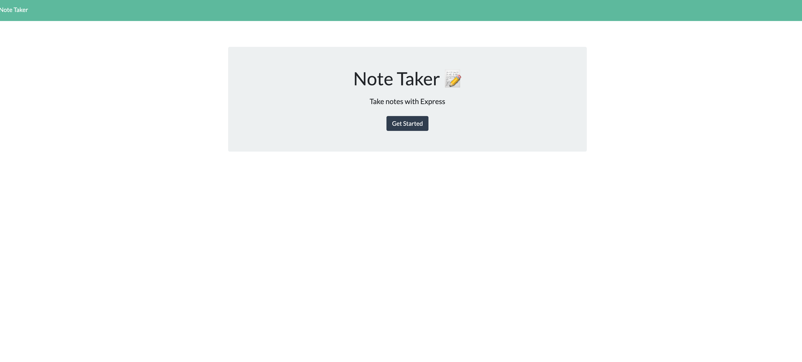
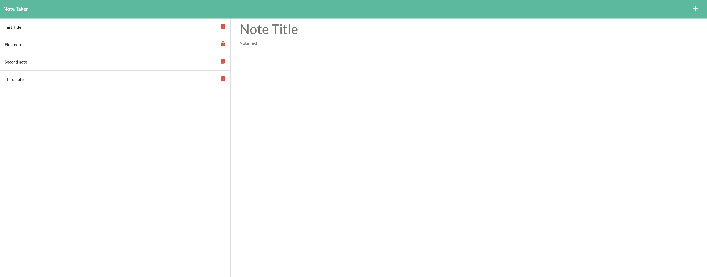
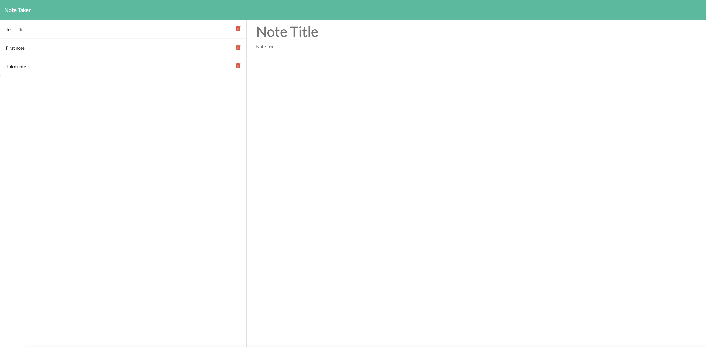

# Description :

This is a simple Note Taker application that allows users to add, view saved notes and also delete the notes if the user don't need that note anymore. This application uses an express backend and save and retrieve note data from a JSON file.

## Deployed Application :
[Note Taker]https://note-taker-anamika.herokuapp.com/

# Table of Contents
* [Demo](#demo)
* [Technology](#technology)
* [Usage](#usage)
* [Features](#features)
* [License](#license)

# User Story
AS A user, I want to be able to write and save notes.

I WANT to be able to delete notes I've written before.

SO THAT I can organize my thoughts and keep track of tasks I need to complete

# Demo :

## Application Preview

|Main Page|Saved Notes|Delete Note
|--|--|--
|||

## Technology :

* 1. [Express.js](https://expressjs.com/)
* 2. [Node.js](https://nodejs.org/en/)
* 3. [uuid](https://www.npmjs.com/package/uuid): Creates random unique id's.

# Features :

1. Used 'Express.js' to build server

2. Used 'fs(File System)' module to read and write from 'db.json' file.

3. Used [uuid](https://www.npmjs.com/package/uuid) npm package to give unique id to each note.

4. Application is deployed on [heroku](https://www.heroku.com/) : Heroku is a container-based cloud Platform as a Service (PaaS). Developers use Heroku to deploy, manage, and scale modern apps.

# License 
This project is license under MIT

